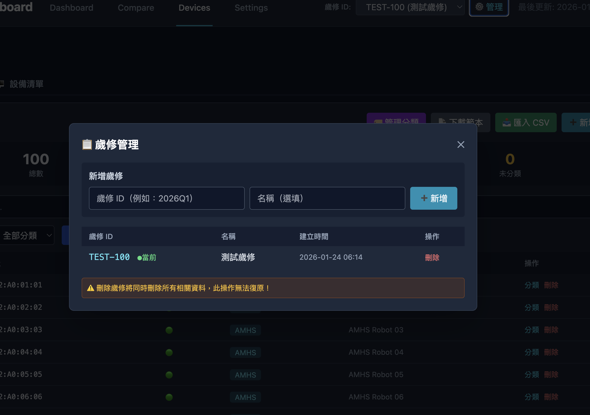
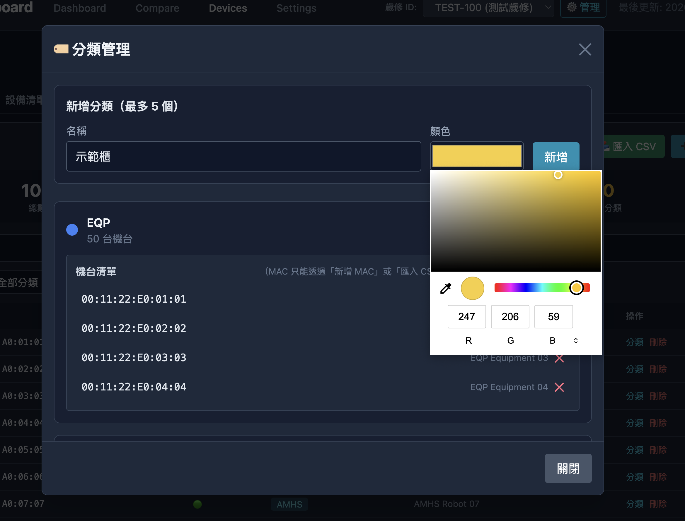
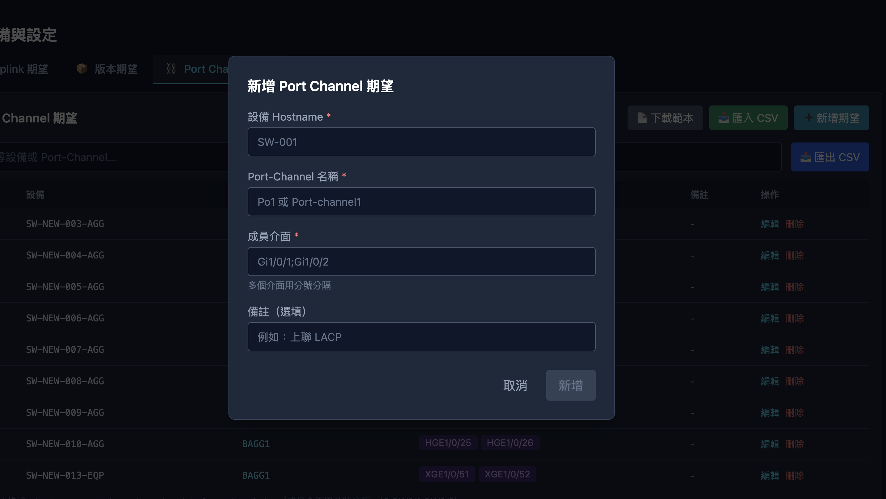

# Network Dashboard

網路設備歲修監控系統 — 支援 8+ 種指標自動評估、客戶端前後對比、失敗原因追蹤。

---

## 頁面預覽

### Dashboard




主控台首頁，顯示 8 個指標的即時通過率卡片（Error Count、光模塊、Ping、版本、Power、Port Channel、Uplink、Fan），右上角顯示整體通過率。點擊任一指標可展開失敗設備詳細清單，包含設備名稱、介面與失敗原因。

### 設備管理（Devices）




管理 MAC 清單與設備清單。MAC 清單支援分類管理（AMHS、示範櫃、不斷電清單 等）、搜尋過濾、CSV 匯入匯出。顯示每筆 MAC 的偵測狀態與所屬分類，支援批次操作。

### 客戶端比較（Compare）


MAC 前後對比結果。上方依分類統計變化數量，中間以時間軸圖表呈現多輪採集趨勢，下方列出每筆 MAC 的新舊值差異，以嚴重程度（critical / warning / info）標記變化類型。

### 設定（Settings）




管理指標評估所需的期望設定，包含 Uplink 期望、版本期望、Port Channel 期望、ARP 來源四個分頁。支援 CSV 匯入匯出與新增期望值，設定後 Indicator 評估時會以此為基準比對。

---

## Quick Start

### 前置需求

| 工具 | 版本 |
|------|------|
| Docker & Docker Compose | 任意近期版本 |
| Python | 3.11+ |
| Node.js | 18+ |

### Step 1: Clone & 環境設定

```bash
git clone https://github.com/coolguazitech/network-dashboard.git
cd network-dashboard

# Python
python3 -m venv venv
source venv/bin/activate
pip install -e ".[dev]"

# Frontend
cd frontend && npm install && cd ..

# 環境變數
cp .env.example .env
```

### Step 2: 啟動資料庫 (Terminal 1)

```bash
docker-compose up -d
```

MariaDB `:3306` + phpMyAdmin `:8080`。

### Step 3: 啟動 Mock API Server (Terminal 2)

> 只有 `USE_MOCK_API=false` 時需要。`USE_MOCK_API=true` 可跳過此步。

```bash
uvicorn tests.mock_api_server:app --port 8001 --reload
```

### Step 4: 初始化 + Seed 資料 (一次性)

```bash
python3 scripts/seed_all.py
```

依序執行：
1. 產生 factory scenario YAML
2. 清理 DB + 建立基礎資料（switches、expectations、categories）
3. Seed 8 個指標（3 輪時間序列：T-6h、T-3h、now）
4. Seed 客戶端資料 + comparisons（3 輪）

### Step 5: 啟動 Backend (Terminal 3)

```bash
uvicorn app.main:app --reload --port 8000
```

- API 文件：http://localhost:8000/api/docs
- 健康檢查：http://localhost:8000/health

### Step 6: 啟動 Frontend (Terminal 4)

```bash
cd frontend
npm run dev
```

開啟 http://localhost:3000

主要頁面：
- **Dashboard** — 8 個指標通過率卡片 + 時間趨勢圖
- **指標詳情** — 點擊任一指標查看失敗設備清單
- **設備清單** — 新舊設備對應、可達性、MAC 偵測狀態
- **客戶端比較** — MAC 前後對比結果，含多時間點統計趨勢

---

## 模式切換

修改 `.env` 後重啟 Backend 即可生效。

| 模式 | `USE_MOCK_API` | `EXTERNAL_API_SERVER` | 需要外部 Server |
|------|:-:|---|:-:|
| **純內建 Mock** | `true` | （不重要） | 否 |
| **Mock API Server** | `false` | `http://localhost:8001` | 是（port 8001） |
| **正式環境** | `false` | `http://real-server:9000` | 是 |

- **純內建 Mock** (`USE_MOCK_API=true`) — 13 個 `MockFetcher` 在記憶體產生確定性資料，不需任何外部 server。適合 UI 開發。
- **Mock API Server** (`USE_MOCK_API=false`) — 打 FastAPI Mock Server，支援 YAML scenario 故障模擬。適合整合測試。
- **正式環境** (`USE_MOCK_API=false`) — 打真實外部網路管理 API。每個 Fetcher 呼叫對應的 API function（FNA 或 DNA），詳見關鍵設計第 5 節。

### 一鍵重置

```bash
python3 scripts/seed_all.py      # 重新 seed 所有資料
uvicorn app.main:app --port 8000  # 重啟 backend
```

---

## 排程系統

設定檔：`config/scheduler.yaml`。Backend 啟動時自動載入 11 個排程 job。

| Job | 間隔 | Service |
|-----|:----:|---------|
| transceiver | 30s | DataCollectionService |
| version | 30s | DataCollectionService |
| uplink | 30s | DataCollectionService |
| fan | 30s | DataCollectionService |
| power | 30s | DataCollectionService |
| error_count | 30s | DataCollectionService |
| ping | 30s | DataCollectionService |
| port_channel | 30s | DataCollectionService |
| mac-table | 30s | DataCollectionService |
| arp-table | 30s | DataCollectionService |
| **client-collection** | **60s** | **ClientCollectionService** |

並發保護：`max_instances=1`、`coalesce=True`、`misfire_grace_time=30s`。

---

## 資料流架構

```
Scheduler Jobs (APScheduler)
       │
       ▼
Service (DataCollectionService / ClientCollectionService)
       │
       │ fetcher_registry.get_or_raise(collection_type)
       ▼
Fetcher.fetch(ctx: FetchContext) → FetchResult
       │
       │ raw_output
       ▼
Parser.parse(raw_output) → list[ParsedData]
       │
       ▼
typed_records (per-type DB tables)
       │
       │ Indicator 讀取
       ▼
Indicator.evaluate()
       │
       ▼
Dashboard API (/summary, /details)
```

### 關鍵設計

#### 1. Fetcher 抽象層 — 一行切換 Mock / Real，Service 零改動

**問題**：舊架構所有 API 呼叫都走同一個 `fetch(site, function, switch_ip)`，無法自訂 HTTP method、URL 格式、request body。`ping_many` 需要傳入目標 IP 清單，但舊介面只接受 3 個字串。

**解法**：每種資料類型有獨立的 `BaseFetcher` 子類別，啟動時透過 `setup_fetchers(use_mock)` 一次註冊。

```
                       ┌─────────────────────┐
                       │   FetcherRegistry   │
                       │                     │
                       │  "transceiver" ──▶ MockTransceiverFetcher  ← USE_MOCK_API=true
                       │  "ping_many"   ──▶ MockPingManyFetcher
                       │  "mac_table"   ──▶ MockMacTableFetcher
                       │   ...              ...
                       └─────────┬───────────┘
                                 │
          setup_fetchers(use_mock=false) 時自動替換：
                                 │
                       ┌─────────▼───────────┐
                       │   FetcherRegistry   │
                       │                     │
                       │  "transceiver" ──▶ TransceiverFetcher      ← 打真實 API
                       │  "ping_many"   ──▶ PingManyFetcher
                       │  "mac_table"   ──▶ MacTableFetcher
                       │   ...              ...
                       └─────────────────────┘
```

**好處**：
- **Service 層完全不知道資料從哪來** — `fetcher_registry.get_or_raise("transceiver")` 拿到的可能是 Mock 也可能是 Real，呼叫端程式碼一模一樣
- **每個 Fetcher 獨立封裝** — 可以各自決定 HTTP method、URL、request body、error handling，不受其他 Fetcher 影響
- **`FetchContext.params` 解決傳參問題** — `ping_many` 透過 `params={"target_ips": [...]}` 傳入目標清單，不再受限於固定參數
- **新增資料類型只需 3 步**：寫 Fetcher → 寫 Parser → 註冊，不動任何 Service 程式碼

#### 2. 採集（Scheduler）與評估（Indicator）分離

```
  Scheduler 週期觸發                    API 請求觸發
        │                                    │
        ▼                                    ▼
  Fetcher → Parser → DB 寫入          Indicator.evaluate() ← DB 讀取
        │                                    │
        │    完全獨立，互不阻塞               │
        ▼                                    ▼
  typed_records 表                    pass_rate / fail_list
```

**好處**：
- **採集失敗不影響 Dashboard 顯示** — Indicator 永遠從 DB 讀取最近一筆成功資料，即使本輪採集超時也能顯示上一輪結果
- **可重複評估** — 資料已在 DB，隨時呼叫 `evaluate()` 不需要重新打外部 API
- **各自獨立調頻率** — 採集可能 30 秒一次，但 Dashboard API 可能每秒被呼叫多次，兩者互不干擾

#### 3. Typed Records — 每種指標獨立表，型別安全

```
  ┌─────────────────┐  ┌──────────────────┐  ┌─────────────────┐
  │ ping_records    │  │ transceiver_     │  │ fan_records     │
  │                 │  │   records        │  │                 │
  │ switch_ip       │  │ switch_ip        │  │ switch_ip       │
  │ is_reachable    │  │ interface_name   │  │ fan_id          │
  │ success_rate    │  │ tx_power         │  │ status          │
  │ avg_rtt         │  │ rx_power         │  │ speed_rpm       │
  └─────────────────┘  │ temperature      │  └─────────────────┘
                       └──────────────────┘
          每張表只有該指標需要的欄位，不浪費空間也不混淆
```

**好處**：
- **欄位語意明確** — `transceiver_records.tx_power` vs 把所有東西塞進 `generic_records.json_data`，查詢和除錯效率差很多
- **可針對單一指標做 index / 查詢最佳化** — 不會因為一張大表而影響其他指標的讀寫效能
- **Schema 即文件** — 看表結構就知道這個指標採集了什麼資料

#### 4. 兩種分母來源 — 指標評估不混淆

不同指標的「總數」來源不同，否則通過率計算會失真：

| 分母類型 | 指標 | 來源 | 為什麼 |
|---------|------|------|--------|
| **期望類** | ping、port_channel、uplink | 使用者定義的期望清單 | 這些指標需要比對「應該有什麼」，沒有期望就無法判斷 |
| **採集類** | power、fan、error_count、transceiver、version | 實際採集到的新設備資料筆數 | 這些指標只需要檢查「採到的資料是否正常」，分母 = 採到多少筆 |

**好處**：
- **通過率語意正確** — `ping` 通過率 = 「期望清單中可達的設備數 / 期望總數」，而非「採到的可達數 / 採到的總數」（後者會漏掉根本沒回應的設備）
- **不會因為少採到而虛增通過率** — 期望類指標的分母固定，沒採到的設備自動算失敗

#### 5. FNA / DNA API Function Layer — 每種資料綁定一個 API 來源

**背景**：外部有兩套網路管理 API：

| 來源 | 簽名 | 特性 |
|------|------|------|
| **FNA** (Factory Network Automation) | `(switch_ip, **kwargs)` | 內部自動偵測廠牌，只需 IP |
| **DNA** (Device Network Automation) | `(vendor_os, switch_ip, **kwargs)` | 需指定廠牌 + IP |

**設計**：每種資料類型恰好綁定一個 API 來源，封裝為 standalone async function。

```
  Fetcher.fetch(ctx)
  ┌─────────────────────────────────────┐
  │ FanFetcher (DNA):                   │
  │   raw = await get_fan_from_dna(     │
  │       ctx.brand, ctx.switch_ip)     │
  │                                     │
  │ AclFetcher (FNA):                   │
  │   raw = await get_acl_from_fna(     │
  │       ctx.switch_ip,                │
  │       interfaces=interfaces)        │
  └─────────────────────────────────────┘
          │
          ▼
  app/fetchers/api_functions.py
  ┌─────────────────────────────────────┐
  │ async def get_fan_from_dna(         │
  │     vendor_os, switch_ip, **kwargs  │
  │ ) -> str:                           │
  │     raise NotImplementedError(...)  │
  │     # TODO: 實作 HTTP 呼叫          │
  └─────────────────────────────────────┘
```

**FNA / DNA 對應表**：

| fetch_type | API Source | API Function |
|-----------|-----------|--------------|
| `transceiver` | DNA | `get_transceiver_from_dna` |
| `version` | DNA | `get_version_from_dna` |
| `uplink` | DNA | `get_uplink_from_dna` |
| `fan` | DNA | `get_fan_from_dna` |
| `power` | DNA | `get_power_from_dna` |
| `error_count` | DNA | `get_error_count_from_dna` |
| `ping` | DNA | `get_ping_from_dna` |
| `port_channel` | FNA | `get_port_channel_from_fna` |
| `mac_table` | DNA | `get_mac_table_from_dna` |
| `arp_table` | FNA | `get_arp_table_from_fna` |
| `interface_status` | DNA | `get_interface_status_from_dna` |
| `acl` | FNA | `get_acl_from_fna` |
| `ping_many` | DNA | `get_ping_many_from_dna` |

**好處**：
- **API 呼叫與 Fetcher 解耦** — API function 是純 async function，可獨立測試
- **每種資料綁定一個來源** — 不是 runtime 決定，語意清晰
- **特殊參數用 `**kwargs`** — `ping_many` 傳 `target_ips`，`acl` 傳 `interfaces`
- **漸進實作** — function 目前是 stub，日後逐一實作

---

## 指標總覽

| 指標 | 說明 | 分母來源 | 通過條件 |
|------|------|----------|----------|
| `ping` | 新設備連通性 | MaintenanceDeviceList | 可達且成功率 >= 80% |
| `power` | 電源供應器 | 新設備數 | 所有 PSU Normal |
| `fan` | 風扇狀態 | 新設備數 | 所有風扇 Normal |
| `transceiver` | 光模塊 Tx/Rx/溫度 | 新設備光模塊數 | 功率與溫度在範圍內 |
| `error_count` | 介面錯誤計數 | 新設備介面數 | CRC/In/Out 錯誤 = 0 |
| `port_channel` | Port-Channel | 期望清單 | 所有成員 UP |
| `uplink` | Uplink 拓撲 | 期望清單 | 鄰居符合期望 |
| `version` | 韌體版本 | 新設備數 | 版本符合期望值 |

---

## 待完成工作 (TODO)

### 1. API Function 實作 — `app/fetchers/api_functions.py`

13 個 API function 目前為 stub（`raise NotImplementedError`）。
每個 function 封裝對一個外部 API source 的 HTTP 呼叫，
日後依實際 API 規格逐一實作。

| API Function | Source | 簽名 |
|-------------|--------|------|
| `get_transceiver_from_dna` | DNA | `(vendor_os, switch_ip)` |
| `get_version_from_dna` | DNA | `(vendor_os, switch_ip)` |
| `get_uplink_from_dna` | DNA | `(vendor_os, switch_ip)` |
| `get_fan_from_dna` | DNA | `(vendor_os, switch_ip)` |
| `get_power_from_dna` | DNA | `(vendor_os, switch_ip)` |
| `get_error_count_from_dna` | DNA | `(vendor_os, switch_ip)` |
| `get_ping_from_dna` | DNA | `(vendor_os, switch_ip)` |
| `get_port_channel_from_fna` | FNA | `(switch_ip)` |
| `get_mac_table_from_dna` | DNA | `(vendor_os, switch_ip)` |
| `get_arp_table_from_fna` | FNA | `(switch_ip)` |
| `get_interface_status_from_dna` | DNA | `(vendor_os, switch_ip)` |
| `get_acl_from_fna` | FNA | `(switch_ip, **kwargs)` |
| `get_ping_many_from_dna` | DNA | `(vendor_os, switch_ip, **kwargs)` |

所有 function 均支援 `**kwargs` 保留給未來擴充。
`acl` 透過 `kwargs` 傳入 `interfaces`，`ping_many` 傳入 `target_ips`。

### 2. 客戶端資料 Parser — `app/parsers/client_parsers.py`

5 個 parser 的 `parse()` 方法目前為 `NotImplementedError`，需根據 Fetcher 實際回傳格式實作：

| Parser | fetch_type | 輸出型別 | 欄位 |
|--------|-----------|----------|------|
| `MacTableParser` | `mac_table` | `list[MacTableData]` | mac_address, interface_name, vlan_id |
| `ArpParser` | `arp_table` | `list[ArpData]` | ip_address, mac_address |
| `InterfaceStatusParser` | `interface_status` | `list[InterfaceStatusData]` | interface_name, link_status, speed, duplex |
| `AclParser` | `acl` | `list[AclData]` | interface_name, acl_number |
| `PingManyParser` | `ping_many` | `list[PingManyData]` | ip_address, is_reachable |

型別定義：`app/parsers/protocols.py`

### 3. Checkpoint 摘要

`app/api/endpoints/maintenance.py` 的 `_generate_checkpoint_summary()` 回傳 placeholder。應查詢該時間點附近的指標結果與客戶端資料產生真實統計。

### 4. 外部 API 連線設定

`.env` 的 `EXTERNAL_API_SERVER` 設定外部 API 位址。`app/fetchers/api_functions.py` 中 13 個 API function 目前為 stub，正式部署時需逐一實作（詳見 TODO 第 1 項）。

---

## 目錄結構

```
network_dashboard/
├── app/
│   ├── main.py                           # FastAPI 入口
│   ├── api/
│   │   ├── routes.py                     # Router 彙整
│   │   └── endpoints/                    # 各功能端點
│   ├── core/
│   │   ├── config.py                     # pydantic-settings (.env)
│   │   └── enums.py                      # Phase, Vendor, Platform
│   ├── db/
│   │   ├── base.py                       # SQLAlchemy async engine
│   │   └── models.py                     # ORM 模型
│   ├── fetchers/
│   │   ├── base.py                       # BaseFetcher, FetchContext, FetchResult
│   │   ├── registry.py                   # FetcherRegistry, setup_fetchers()
│   │   ├── api_functions.py             # 13 個 API function stub (FNA/DNA)
│   │   ├── mock.py                       # 13 個 Mock Fetcher
│   │   └── implementations.py           # 13 個 Real Fetcher (呼叫 api_functions)
│   ├── indicators/                       # 8 種指標評估器
│   ├── parsers/
│   │   ├── client_parsers.py             # 客戶端 parser (TODO)
│   │   ├── protocols.py                  # ParsedData 型別
│   │   ├── registry.py                   # Parser auto-discovery
│   │   └── hpe_comware/                  # HPE Comware parsers
│   ├── repositories/                     # Data access layer
│   └── services/
│       ├── api_client.py                 # External / Mock API client
│       ├── data_collection.py            # 指標資料採集
│       ├── client_collection_service.py  # 客戶端資料採集 (Phase 1-4)
│       ├── scheduler.py                  # APScheduler 排程管理
│       └── client_comparison_service.py  # 客戶端前後對比
├── config/
│   ├── scheduler.yaml                    # 排程設定
│   ├── indicators.yaml                   # 指標評估規則
│   └── switches.yaml                     # Switch 定義
├── scripts/
│   ├── seed_all.py                       # 統一 seed（一鍵）
│   ├── init_factory_data.py              # DB 初始化
│   ├── generate_factory_scenarios.py     # YAML scenario 產生
│   ├── factory_device_config.py          # 共用設備配置
│   └── seed_client_data.py              # 客戶端資料 seed
├── tests/
│   ├── mock_api_server.py                # Mock API Server
│   └── scenarios/                        # YAML scenario 檔案
├── frontend/                             # Vue 3 + Vite + Tailwind + ECharts
├── docker-compose.yml                    # MariaDB + phpMyAdmin
├── .env.example                          # 環境變數模板
└── pyproject.toml
```

---

## API 端點

| 方法 | 路徑 | 說明 |
|------|------|------|
| GET | `/api/v1/dashboard/maintenance/{id}/summary` | 所有指標通過率摘要 |
| GET | `/api/v1/dashboard/maintenance/{id}/indicator/{type}/details` | 單一指標詳情 + 失敗清單 |
| GET | `/api/v1/maintenance` | 歲修列表 |
| POST | `/api/v1/maintenance` | 建立歲修 |
| DELETE | `/api/v1/maintenance/{id}` | 刪除歲修 + 所有相關資料 |
| GET | `/api/v1/comparisons/timepoints/{id}` | 歷史時間點 |
| GET | `/api/v1/comparisons/statistics/{id}` | 統計趨勢 |
| POST | `/api/v1/comparisons/generate/{id}` | 產生對比結果 |
| GET | `/api/v1/maintenance-devices/{id}` | 設備清單 + 可達性 |
| GET | `/api/v1/mac-list/{id}` | MAC 清單 + 偵測狀態 |
| POST | `/api/v1/indicators/{name}/collect` | 手動觸發採集 |

完整 API 文件：http://localhost:8000/api/docs

---

## 支援廠牌

| 廠牌 | 平台 | Parser 支援 |
|------|------|-------------|
| Cisco | IOS | transceiver, neighbor |
| Cisco | NX-OS | transceiver, neighbor, port_channel, error, fan, power |
| HPE | Comware | transceiver, neighbor, port_channel, error, fan, power, ping, version |

---

## 環境變數

參考 `.env.example`：

| 變數 | 預設值 | 說明 |
|------|--------|------|
| `DB_HOST` | `localhost` | MariaDB 位址 |
| `DB_PORT` | `3306` | MariaDB 埠號 |
| `DB_NAME` | `network_dashboard` | 資料庫名稱 |
| `DB_USER` | `admin` | 資料庫帳號 |
| `DB_PASSWORD` | `admin` | 資料庫密碼 |
| `EXTERNAL_API_SERVER` | `http://localhost:9000` | 外部 API 位址 |
| `EXTERNAL_API_TIMEOUT` | `30` | API timeout (秒) |
| `USE_MOCK_API` | `false` | `true` = 內建 MockApiClient；`false` = 打 EXTERNAL_API_SERVER |
| `APP_ENV` | `development` | 環境 (development / production) |
| `APP_DEBUG` | `false` | Debug 模式 + auto-reload |

---

## 技術棧

**後端** — Python 3.11+, FastAPI, SQLAlchemy 2.0 (async), Pydantic 2, MariaDB (aiomysql), APScheduler

**前端** — Vue 3, Vite, Tailwind CSS, ECharts, Axios, Vue Router
