# NETORA — 歲修驗收自動化平台

> **本文件 = 簡報 + 使用說明 + 開發指南**
>
> - **系統概覽**：報告用，10-12 分鐘快速了解 NETORA 解決什麼問題、有哪些亮點
> - **Part A**：前端用戶操作手冊（保姆級）
> - **Part B**：開發人員指南（擴充 Fetcher / Parser）

---

# 系統概覽

## 目前歲修驗收遇到的問題

| # | 痛點 | 現況描述 | 造成的影響 |
|---|------|---------|-----------|
| ❶ | **操作不便** | 服務未上 TKS，每次都要透過 OTJH 進 bastion 機再用 docker 起服務 | 流程繁瑣，操作體驗差 |
| ❷ | **功能不完整** | 缺少光模組、CRC Error、Port-Channel、版本驗收等關鍵檢查項 | 缺乏自動化驗收，全靠人工下指令、用肉眼逐筆比對 |
| ❸ | **Client 追蹤困難** | 不易查詢不同起始點與當前的 compare | 歲修前就不通的 client，若沒做好快照就難以澄清（lesson learnt） |

---

## NETORA 是什麼

> NETORA 是一套**全自動的網路設備歲修驗收平台**，
> 接入既有 FNA / DNA / GNMS API，從資料採集、健康判定到報告生成，全部自動完成。

```
         既有 API（FNA / DNA / GNMS）
                    ↓ 自動週期採集
              ┌──────────┐
  瀏覽器 ────→│  NETORA  │← 自動判定 Pass/Fail
              └────┬─────┘
                   ↓
       Dashboard + 一鍵匯出報告
```

**關鍵數字**：

- **8 大指標**全覆蓋（光模組、風扇、電源、版本、Uplink、Port-Channel、CRC Error、Ping）
- 支援 **3 大廠牌**（HPE、Cisco IOS、Cisco NXOS）
- 採集間隔最短 **30 秒**，每小時自動 Checkpoint 快照
- **Web UI 操作**，不需 SSH、不需進 bastion

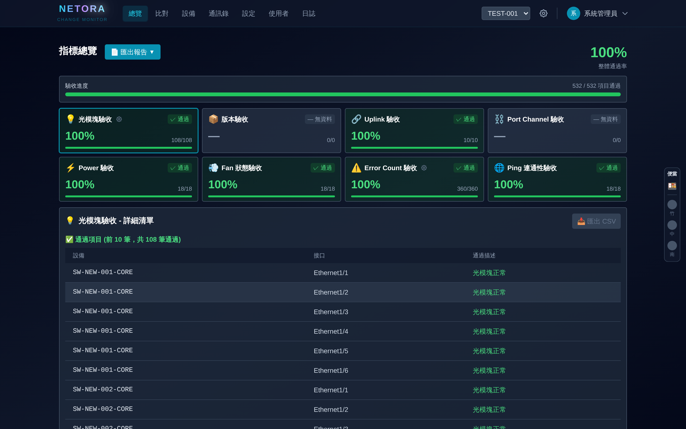

---

## 亮點 ① — 即時掌握全局進度

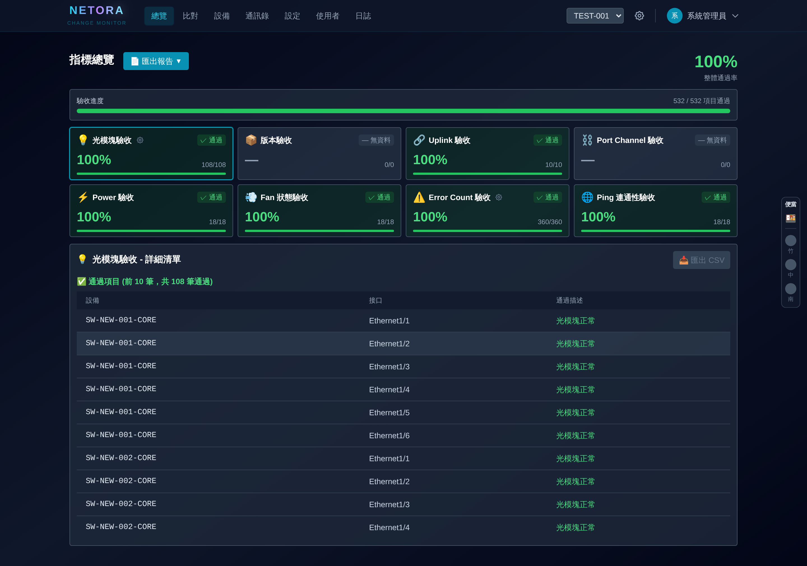

```
┌──────────────────────────────────────────────────┐
│  指標總覽                                  95.2%  │ ← ① 整體通過率
├──────────────────────────────────────────────────┤
│  ▓▓▓▓▓▓▓▓▓▓▓▓▓▓░░  驗收進度                     │ ← ② 進度條
├──────────────────────────────────────────────────┤
│  ┌─────┐ ┌─────┐ ┌─────┐ ┌─────┐                │
│  │🔌光模│ │🌀風扇│ │⚡電源│ │📋版本│               │ ← ③ 指標卡片
│  │ 95% │ │100% │ │100% │ │ 80% │  顏色=狀態      │    綠/紅/紫/灰
│  └─────┘ └─────┘ └─────┘ └─────┘                │
│  ┌─────┐ ┌─────┐ ┌─────┐ ┌─────┐                │
│  │🔗Link│ │🔀PoC │ │📊CRC │ │📡Ping│              │
│  └─────┘ └─────┘ └─────┘ └─────┘                │
├──────────────────────────────────────────────────┤
│  ❌ 未通過項目 (3)                    📥匯出CSV   │ ← ④ 點擊即展開
│  ┌──────┬──────────┬──────────────────────┐      │    定位問題設備
│  │ 設備  │  介面     │ 問題描述              │      │
│  │SW-01 │ Gi0/1    │ Rx power -20.5 < -18│      │
│  └──────┴──────────┴──────────────────────┘      │
└──────────────────────────────────────────────────┘
```

**解決痛點 ❶❷**：
- **直接在瀏覽器操作** — 不需 OTJH、不需 bastion、不需 SSH
- **光模組、CRC Error、Port-Channel、版本驗收全部補齊** — 以前沒有的現在都有了
- **閾值可在 UI 上即時調整（全新功能）** — 點擊齒輪即時設定，不用改程式碼、不用重部署
- **一鍵匯出 Sanity Check Report** — 自包含 HTML 報告直接下載，含整體 PASS/FAIL 判定 + 8 大指標詳細結果

> 詳細操作說明見 [Part A 第 5 節：指標總覽](#5-指標總覽dashboard)

---

## 亮點 ② — Checkpoint 快照解決澄清難題

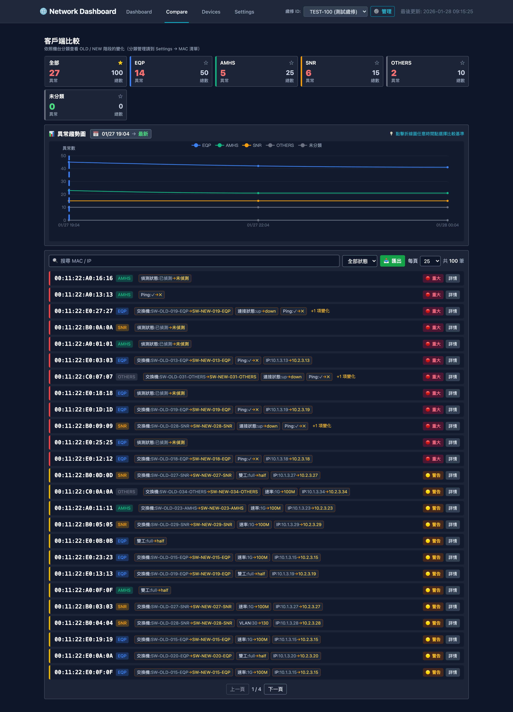

**場景對比**：

```
以前（痛點 ❸）：
  "這台 client 不通，是歲修換機造成的嗎？"
  → 基準快照時間點難抓 → 沒有歷史記錄 → 死無對證

現在（NETORA）：
  系統每小時自動快照 → 選擇歲修前的 Checkpoint
  → 立即看到「這台 client 在歲修前就已經不通了」
  → 澄清完畢，不用吵
```

**功能要點**：
- **每小時自動 Checkpoint** — 完整記錄每個 client 的偵測狀態
- **任意時間點比較** — 選擇「歲修開始前」vs「現在」，差異一覽無遺
- **四種狀態追蹤** — 已偵測 / 不匹配 / 未偵測 / 未檢查
- **標籤修改** — 已知問題可手動標記為正常（如：歲修前已關機的 client，標記後不再列為異常）
- **統計卡片** — 即時呈現遷移進度（已偵測 N / 總數 M）

**技術補充 — 多時間點即時運算優化**：

支援多個 Checkpoint 比較帶來一個問題：每個時間點都要從資料庫撈資料再比對，時間點越多頁面載入越慢。我們的做法是一次把所有資料撈回來，在記憶體中用二分搜尋（Binary Search）快速定位每個時間點對應的記錄，不再重複查資料庫。

| | 資料庫查詢 | 運算方式 |
|---|---|---|
| 優化前 | 隨時間點數量**線性成長** | 逐筆掃描 |
| 優化後 | **固定 4 次**，不隨時間點增加 | 二分搜尋 O(log N) |

實際效果估算（1,000 台客戶端設備）：

| 比較時間點數 | 優化前 | 優化後 |
|---|---|---|
| 10 | ~2 秒 | ~0.2 秒 |
| 30 | ~6 秒 | ~0.2 秒 |
| 60 | ~13 秒 | ~0.2 秒 |

優化後不管時間點再多，回應時間都維持在 0.2 秒左右。我們不只解決了功能問題，效能也有考慮到。

> 詳細操作說明見 [Part A 第 6 節：客戶端比對](#6-客戶端比對)

---

## 全功能 Web 介面

| 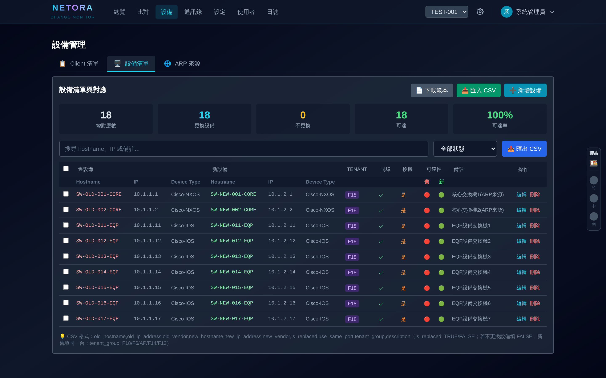 | 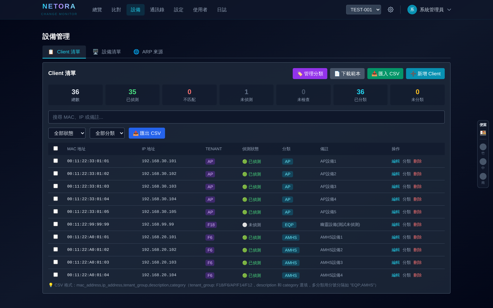 |
|:---:|:---:|
| 設備管理 | Client 清單 |
| 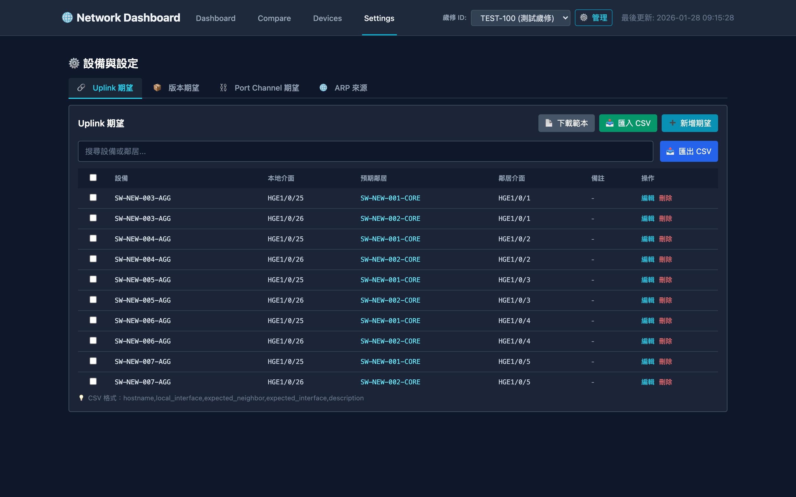 | 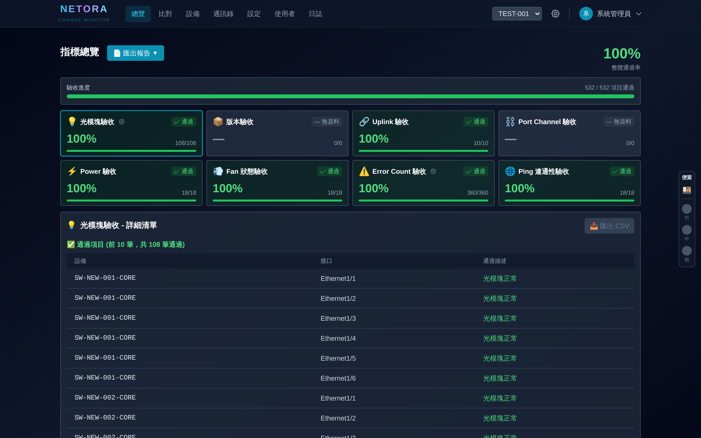 |
| 設定頁面 | 報告匯出 |

| 操作 | 以前 | 現在 (NETORA) |
|------|------|---------------|
| 建立歲修 | 手動建資料夾 / docker CLI 起服務 | UI 上輸入 ID 即建立 |
| 設定 Uplink 期望 | 自動偵測 | 精準給定 |
| 查看指標結果 | 發信通知 | 點開 Dashboard 即看 |
| 匯出驗收報告 | 逐項 display，人工彙整 | 一鍵 HTML 報告 |
| 追蹤 Client 遷移 | 單基準點發信通知 | 多基準點比對顯示在 UI |
| 調整判定閾值 | 無此功能 | UI 齒輪按鈕即時調整 |

---

## 平台管理與團隊協作

| 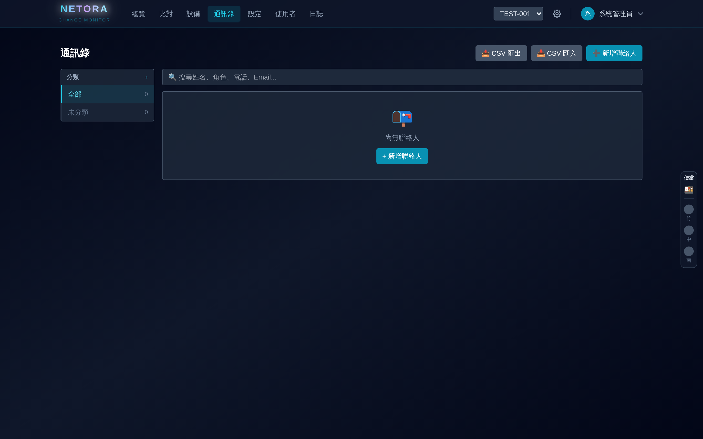 | 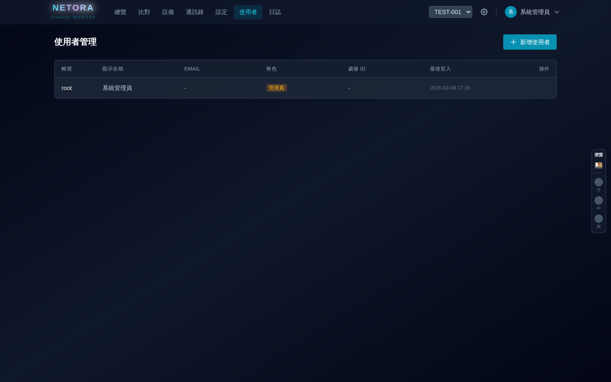 | 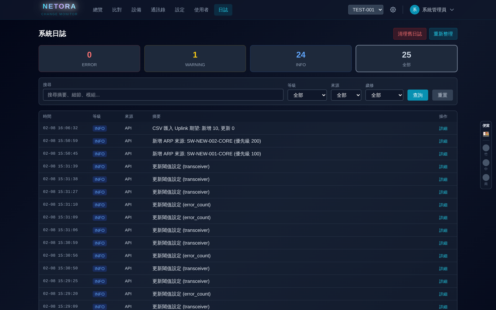 |
|:---:|:---:|:---:|
| 通訊錄 | 帳號管理 | 系統日誌 |

### 歲修通訊錄

```
┌──────────────────────────────────────┐
│ 分類          │  聯絡人清單           │
│ ┌──────────┐  │  ┌─────────────────┐ │
│ │ 🟦 網路組  │  │  │ 王大明  ext.1234│ │
│ │ 🟩 系統組  │  │  │ 李小華  ext.5678│ │
│ │ 🟨 廠商    │  │  │ ...             │ │
│ └──────────┘  │  └─────────────────┘ │
│               │  📥 CSV 匯入/匯出    │
└──────────────────────────────────────┘
```

- 歲修現場臨時要找人？打開通訊錄立刻查到負責人
- 分類一目了然：各 Task 相關人員、廠商、負責範圍清清楚楚
- CSV 一鍵匯入匯出，每場歲修獨立通訊錄

> 詳細操作說明見 [Part A 第 8 節：通訊錄](#8-通訊錄)

### 帳號權限管理

```
┌────────────────────────────────┐
│  三級權限控管                    │
│                                │
│  👑 ROOT  — 系統管理員          │
│  📋 PM    — 歲修負責人（可編輯） │
│  👁 GUEST — 唯讀觀察（需啟用）   │
└────────────────────────────────┘
```

- ROOT 統一管控所有歲修與帳號
- PM 綁定特定歲修，各司其職
- Guest 帳號需管理員啟用，安全可控

> 詳細操作說明見 [Part A 第 9 節：使用者管理](#9-使用者管理root-專屬)

### 系統日誌

```
┌──────────────────────────────────────┐
│  🔴 ERROR: 3  🟡 WARNING: 12  🔵 INFO: 156  │
├──────────────────────────────────────┤
│  時間        │ 等級  │ 摘要          │
│  02-08 14:30 │ ERROR │ 採集超時 SW-03│
│  02-08 14:28 │ INFO  │ 快照完成      │
└──────────────────────────────────────┘
```

- 僅系統管理員可見，掌握成員關鍵操作與變更紀錄
- 故障排除：採集異常、系統錯誤一目了然，快速定位問題
- 完整歷史紀錄：按等級 / 來源 / 歲修 ID 篩選，支援自動清理

> 詳細操作說明見 [Part A 第 10 節：系統日誌](#10-系統日誌root-專屬)

---

## 技術特色與部署方式

| 特色 | 說明 |
|------|------|
| 🔌 **即插即用** | 接入既有 FNA/DNA/GNMS API，零改動 |
| 🧩 **模組化** | 新增指標只需寫一個 Parser 檔案（未來導入 codegen 後更快） |
| 📦 **Docker 容器化** | 一個指令啟動，不汙染環境 |
| 🔄 **Mock 模式** | 不接 API 也能展示全部功能 |
| 📊 **智慧快取** | 資料不變不寫 DB，降低 I/O 負載 |

```
┌────────────┐     ┌──────────────┐
│  MariaDB   │←────│   NETORA     │──→ 瀏覽器
│  (資料庫)   │     │  (App + UI)  │
└────────────┘     └──────┬───────┘
                          │
                    FNA / DNA / GNMS
```

- `docker-compose up -d` 一鍵啟動
- 無需安裝 Python、Node.js
- 未來可輕鬆遷移至 TKS

> 開發人員擴充方式見 [Part B：開發人員指南](#part-b開發人員指南--擴充-fetcher--parser)

---

## Before vs After 效益總覽

| 面向 | Before (現況) | After (NETORA) |
|------|--------------|----------------|
| **操作方式** | OTJH → bastion → docker，流程繁瑣 | 瀏覽器直接開 |
| **檢查項目** | 缺光模組、CRC Error、Port-Channel、版本驗收 | 8 大指標全覆蓋 |
| **Client 澄清** | 人工調查，耗時耗力 | Checkpoint 快照，秒級澄清 |
| **進度掌握** | 問人才知道 | Dashboard 即時呈現 |
| **驗收報告** | 逐項 display，人工彙整 | 一鍵產出 HTML |
| **多人協作** | 各自記錄 | 統一平台 + 帳號權限 |
| **閾值調整** | 以前沒有此功能 | UI 即時調整，不需改碼重部署 |

---

## 後續規劃 (Roadmap)

- [ ] 上線 TKS，正式納入部門工具鏈
- [ ] 新增 GK 驗收指標
- [ ] 擴展至 DC、OA 等其他單位歲修需求 — 高擴展性架構，新增 Parser 即可適配
- [ ] 自動告警通知（Email / Teams）

---

## Jeff's Easter Egg — 便當紅綠燈 🍱

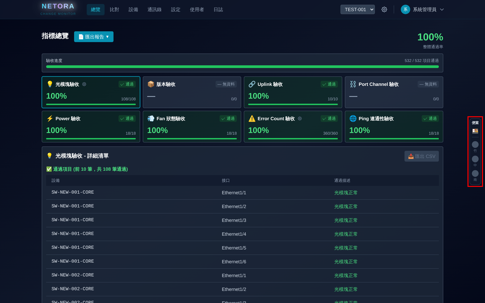

歲修現場最重要的事情是什麼？ —— **便當到了沒！**

畫面右側常駐一個迷你面板，即時追蹤三大園區的便當送達狀態：

```
  ┌─────┐
  │便當  │
  │ 🍱  │
  │      │
  │ ⚫ 竹│  ← 灰色：無便當
  │ 🔴 中│  ← 紅色：等待中（已訂、在路上）
  │ 🟢 南│  ← 綠色 ✓：已送達！
  │      │
  └─────┘
```

- 點擊燈號即可切換狀態（灰 → 紅 → 綠 → 灰）
- 每 10 秒自動同步，所有人即時看到
- 再也不用在群組問「便當到了嗎？」

> 💡 This feature was brought to you by **Jeff** — 歲修現場的真正需求 😄

---

# Part A：前端用戶使用說明

## 1. 系統簡介

NETORA 是一套**網路設備歲修驗收系統**，用於監控交換器更換後的各項健康指標，自動採集、自動判定、自動生成報告。

### 系統功能一覽

| 頁面 | 功能 | 適用角色 |
|------|------|---------|
| 總覽 | 指標通過率、失敗清單、報告匯出 | 所有人 |
| 比對 | 客戶端 MAC 設備在不同時間點的變化比較 | 所有人 |
| 設備 | 管理設備清單、Client 清單、分類 | 所有人 |
| 通訊錄 | 管理聯絡人資訊 | 所有人 |
| 設定 | Uplink 期望、版本期望、分類管理 | 所有人 |
| 使用者 | 帳號管理、權限指派 | 僅 Root |
| 日誌 | 系統事件記錄、錯誤追蹤 | 僅 Root |

---

## 2. 登入系統

> 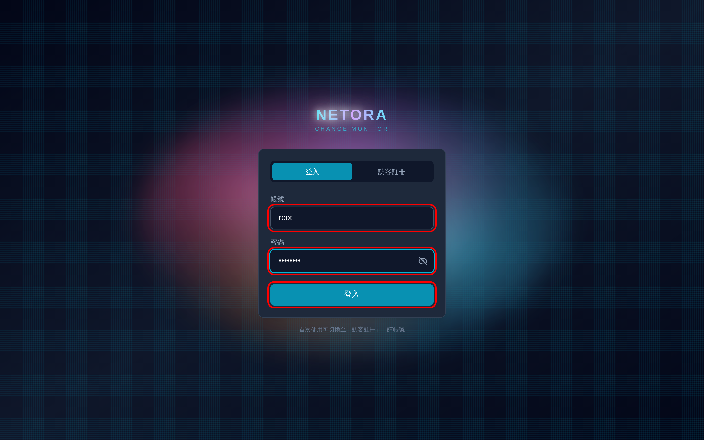
> *登入頁面 — 帳號密碼欄位與登入按鈕（紅框標示）*

1. 開啟瀏覽器，輸入系統網址（如 `http://localhost:8000`）
2. 輸入帳號與密碼
   - 預設管理員：帳號 `root`、密碼 `admin123`
3. 點擊「登入」
4. 首次使用建議先**修改預設密碼**

### 2.1 帳號類型

| 類型 | 說明 | 可用功能 |
|------|------|---------|
| **Root** | 系統管理員 | 所有功能 + 使用者管理 + 系統日誌 + 歲修管理 |
| **PM** | 歲修負責人 | 被指派歲修的所有查看與編輯功能 |
| **Guest** | 唯讀觀察者 | 被指派歲修的查看功能（需管理員啟用） |

---

## 3. 歲修管理（Root 專屬）

歲修（Maintenance）是系統的核心單位，所有資料都歸屬於特定歲修。

> 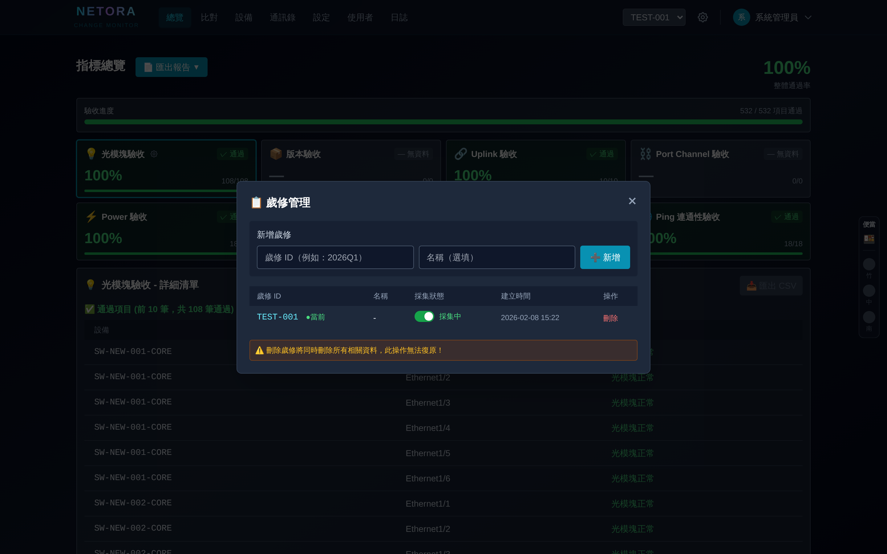
> *歲修管理彈窗 — 新增歲修 ID、Toggle 採集狀態、刪除操作*

### 3.1 新增歲修

1. 點擊導航列右側的 **齒輪圖示** ⚙️
2. 在彈出視窗中填入：
   - **歲修 ID**（必填）：如 `2026Q1`
   - **名稱**（選填）：如 `2026年第一季歲修`
3. 點擊「➕ 新增」

### 3.2 切換歲修

- 在導航列右側的下拉選單中選擇歲修
- 系統會記住你的選擇（下次登入自動恢復）

### 3.3 暫停/恢復採集

- 在歲修管理視窗中，點擊 **Toggle 開關** 即可暫停或恢復該歲修的自動採集
- 暫停後，歲修名稱前會顯示 `[已暫停]`

### 3.4 刪除歲修

> ⚠️ **此操作不可逆！** 將同時刪除所有相關設備、指標、採集資料。

1. 點擊歲修列表中的「刪除」
2. 系統要求你輸入歲修 ID 以確認
3. 輸入完全一致的 ID 後點擊「確認刪除」

---

## 4. 設備管理

> 
> *設備管理 — 設備清單 Tab，顯示新舊設備對應、廠牌、租戶群組等*

設備頁面有多個 Tab 分頁：

### 4.1 設備清單 Tab

管理歲修中涉及的交換器設備。

**上傳設備清單 CSV**：
1. 點擊「📄 下載範本」取得 CSV 格式
2. 按範本填入設備資料
3. 點擊「📥 匯入 CSV」上傳

**CSV 格式欄位**：

| 欄位 | 必填 | 說明 |
|------|------|------|
| old_hostname | ✓ | 舊設備 hostname |
| old_ip_address | ✓ | 舊設備 IP（IPv4/IPv6） |
| old_vendor | ✓ | 舊設備廠牌：`HPE` / `Cisco-IOS` / `Cisco-NXOS` |
| new_hostname | ✓ | 新設備 hostname |
| new_ip_address | ✓ | 新設備 IP（IPv4/IPv6） |
| new_vendor | ✓ | 新設備廠牌：`HPE` / `Cisco-IOS` / `Cisco-NXOS` |
| is_replaced | | 是否實體換機（`true`/`false`，預設 `false`） |
| use_same_port | | 是否沿用相同 port（預設 `true`） |
| tenant_group | | GNMS Ping 租戶群組（預設 `F18`） |
| description | | 備註說明 |

**批量操作**：勾選多筆設備 → 批量刪除

### 4.2 Client 清單 Tab

管理該歲修需要追蹤的客戶端 MAC 地址。

> 
> *Client 清單 — 統計卡片、偵測狀態、分類篩選*

**功能特色**：
- **統計卡片**：總數、已偵測、不匹配、未偵測、未檢查、已分類、未分類
- **搜尋**：支援 MAC、IP、備註搜尋
- **篩選**：依狀態（已偵測/不匹配/未偵測/未檢查）或分類篩選
- **批量操作**：勾選多筆 → 批量分類 / 批量刪除
- **匯入/匯出**：CSV 格式支援

**Client 狀態說明**：

| 狀態 | 顏色 | 說明 |
|------|------|------|
| 🟢 已偵測 | 綠色 | MAC 已在新/舊交換器上偵測到 |
| 🔴 不匹配 | 紅色 | MAC ARP Table 資訊跟用戶給的不一致 |
| ⚪ 未偵測 | 灰色 | MAC Ping 不到 |
| ⚙️ 未檢查 | 深灰 | 尚未進行檢查 |

### 4.3 分類管理

將 Client 分組管理（如按示範櫃、不斷電清單等），方便批次查看與報告。

### 4.4 ARP 來源 Tab

設定 Client 偵測時，系統要從哪些交換器的 ARP Table 查詢 MAC-IP 對應。

**批量操作**：勾選多筆 → 批量刪除

---

## 5. 指標總覽（Dashboard）

> 
> *Dashboard — 整體通過率、8 大指標卡片、通過/失敗詳細清單*

Dashboard 是系統的核心頁面，一眼掌握所有指標狀態。

### 5.1 頁面結構

```
┌──────────────────────────────────────────────┐
│  指標總覽              📄匯出報告    整體通過率 XX%  │
├──────────────────────────────────────────────┤
│  ▓▓▓▓▓▓▓▓▓▓▓▓░░░  驗收進度  XX/XX 項目通過     │
├──────────────────────────────────────────────┤
│  ┌─────┐ ┌─────┐ ┌─────┐ ┌─────┐            │
│  │光模組│ │風  扇│ │電  源│ │版  本│  ← 指標卡片   │
│  │ 95% │ │100% │ │100% │ │ 80% │            │
│  └─────┘ └─────┘ └─────┘ └─────┘            │
│  ┌─────┐ ┌─────┐ ┌─────┐ ┌─────┐            │
│  │Uplink│ │PoC  │ │Error│ │Ping │            │
│  │ 90% │ │ 85% │ │100% │ │ 70% │            │
│  └─────┘ └─────┘ └─────┘ └─────┘            │
├──────────────────────────────────────────────┤
│  XXX - 詳細清單                 📥匯出CSV     │
│  ❌ 未通過項目 (3)                            │
│  ┌──────┬──────┬───────────────────────┐     │
│  │ 設備  │ 介面  │ 問題描述               │     │
│  ├──────┼──────┼───────────────────────┤     │
│  │SW-01 │Gi0/1 │ Rx power -20.5 < -18 │     │
│  └──────┴──────┴───────────────────────┘     │
│  ✅ 通過項目 (前 10 筆，共 45 筆通過)          │
└──────────────────────────────────────────────┘
```

### 5.2 指標卡片顏色

| 顏色 | 狀態 | 說明 |
|------|------|------|
| 🟢 綠色 | 全部通過 | 通過率 100% |
| 🟡 黃色 | 部分通過 | 通過率 > 0% 且 < 100% |
| 🔴 紅色 | 有失敗項 | 存在未通過的設備 |
| 🟣 紫色 | 採集異常 | 有設備發生 Collection Error（無法連線等） |
| ⚫ 灰色 | 無資料 | 尚未採集到任何資料 |

### 5.3 八大指標說明

| 指標 | 圖示 | 說明 | 判斷方式 |
|------|------|------|---------|
| 光模組 | 🔌 | Tx/Rx 光功率、溫度、電壓 | 超出閾值 = 失敗 |
| 風扇 | 🌀 | 風扇運轉狀態 | 非 ok/good/normal = 失敗 |
| 電源 | ⚡ | PSU 供電狀態 | 非 ok/good/normal = 失敗 |
| 版本 | 📋 | 韌體版本比對 | 與期望版本不一致 = 失敗 |
| Uplink | 🔗 | 上行鏈路鄰居拓撲 | 與期望鄰居不一致 = 失敗 |
| Port-Channel | 🔀 | LAG 成員完整性 | 成員缺失或 down = 失敗 |
| 錯誤計數 | 📊 | 介面 CRC/Error 計數 | 超過閾值 = 失敗 |
| Ping | 📡 | 設備可達性 | 不可達 = 失敗 |

### 5.4 閾值設定

> 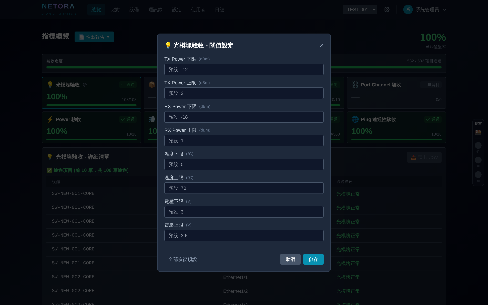
> *閾值設定彈窗 — TX/RX Power、溫度、電壓的上下限均可調整*

部分指標（光模組、錯誤計數等）支援在前端調整閾值：
1. 點擊指標卡片標題旁的 **⚙️ 齒輪圖示**
2. 調整閾值（如 Tx Power 最小值 -12.0 dBm）
3. 儲存後立即生效

### 5.5 匯出 Sanity Check Report

> 
> *匯出報告下拉選單 — 預覽 / 下載 HTML*

點擊「📄 匯出報告」下拉選單：
- **👁️ 預覽**：在新分頁中預覽 HTML 報告
- **📥 下載 HTML**：下載完整 HTML 報告檔（檔名格式：`sanity_report_{歲修ID}_{時間戳}.html`）

**報告內容**：
- **整體狀態徽章**：PASS（≥95%）/ WARNING（80-94%）/ FAIL（<80%）
- **整體通過率**：進度條 + 總檢查數、通過數、失敗數
- **8 大指標卡片**：每個指標各一張卡片，含通過率、失敗/通過清單（最多顯示 20 筆失敗 + 10 筆通過）
- **自包含 HTML**：CSS 內嵌，無需外部資源，直接用瀏覽器打開即可
- **列印友好**：內建 `@media print` 樣式，Ctrl+P 直接列印

---

## 6. 客戶端比對

> 
> *客戶端比對 — Checkpoint 選擇、異常趨勢圖、分類統計卡片、比對結果表格*

比對功能用於觀察客戶端 MAC 設備在不同時間點之間的變化。

### 6.1 Checkpoint 概念

- 系統每隔固定時間（預設 1 小時）自動產生一個 **Checkpoint 快照**
- Checkpoint 記錄當時所有客戶端的偵測狀態（IP、Switch、Interface、Speed、Duplex、ACL 等）
- 選擇某個 Checkpoint 後，系統比較「該時間點」與「最新快照」的差異

### 6.2 Checkpoint 選擇

1. 展開「📅 選擇比較基準」面板
2. 選擇日期 Tab（支援多天，今日標記「(今日)」）
3. 點選某個小時的 Checkpoint 格子
   - 格子顏色：紅色（有異常）/ 綠色（無異常）/ 灰色（無資料）
   - 徽章顯示：異常數 / 總數
   - 預設 Checkpoint 標記「預設」黃字
4. 選擇紀錄自動儲存，下次進入頁面自動恢復

### 6.3 異常趨勢圖

- **📈 異常趨勢**：折線圖顯示各時間點的異常數量變化
- 總趨勢線 + 各分類獨立趨勢線（顏色對應分類）
- 可點擊圖例開關個別分類線條

### 6.4 分類統計卡片

每個分類一張卡片，顯示：
- 分類名稱（左側色條）
- 異常數（大字，紅色 = 有異常，綠色 = 正常）
- 總數、未偵測數
- **★ 星號篩選**：點擊星號只顯示該分類的比對結果

### 6.5 比對結果清單

**篩選與控制**：
- **搜尋框**：即時搜尋 MAC / IP
- **嚴重程度篩選**：全部 / 有異常 / 重大問題 / 警告
- **每頁筆數**：10 / 25 / 50 / 100
- **📥 匯出 CSV**：匯出完整比對結果（含 Before/Current 所有欄位 + 嚴重程度 + 差異說明）

**每筆紀錄顯示**：
- MAC 位址 + 分類標籤
- 差異摘要（最多顯示 3 項變更：欄位名：舊值 → 新值）
- 嚴重程度徽章（🔴 重大 / 🟡 警告 / ✓ 正常 / ⚫ 未偵測）
- 「詳情」按鈕 → 展開完整 Before vs Current 對比

**比對結果分類**：
- **新增偵測到的設備** — Before 未偵測，Current 偵測到
- **消失的設備** — Before 偵測到，Current 未偵測（嚴重）
- **位置變動的設備** — Switch / Interface 改變
- **Speed / Duplex / ACL / VLAN 不一致** — 屬性變更

### 6.6 嚴重程度判定

| 嚴重程度 | 顏色 | 觸發條件 |
|---------|------|---------|
| 🔴 重大 | 紅色 | Switch 改變、Link down、Ping 不通、ACL 失敗 |
| 🟡 警告 | 黃色 | Speed / Duplex / VLAN 改變 |
| ✓ 正常 | 綠色 | 無變化，或變化在預期內（如設備換機映射） |
| ⚫ 未偵測 | 灰色 | Before & Current 都未偵測到 |

### 6.7 標籤修改（Override）

點擊嚴重程度徽章可手動修改判定：
- 🔴 重大 / 🟡 警告 / ✓ 正常
- 🔄 恢復自動：還原為系統自動計算的嚴重程度
- 修改後顯示 🔧 紫色圖示，滑鼠懸停可看原始嚴重程度
- **使用時機**：已知問題（如歲修前已關機的 client）可手動標記為正常

### 6.8 自動更新

- 比對結果每 60 秒自動刷新（靜默更新，不顯示載入動畫）
- 頁面右上角顯示「最後更新: {時間}（每分鐘自動更新）」

---

## 7. 設定

> 
> *設定頁面 — Uplink 期望 Tab，含 CSV 匯入/匯出、新增/編輯/刪除功能*

### 7.1 Uplink 期望

定義每台設備的上行鏈路應連接到哪個鄰居。

**CSV 匯入格式**：

| 欄位 | 必填 | 說明 |
|------|------|------|
| hostname | ✓ | 設備 hostname |
| local_interface | ✓ | 本地介面（如 Eth1/1） |
| expected_neighbor | ✓ | 預期鄰居 hostname |
| expected_interface | ✓ | 預期鄰居介面 |
| description | | 備註 |

操作：
1. 點擊「📄 下載範本」取得 CSV 模板
2. 填入 Uplink 期望值
3. 點擊「📥 匯入 CSV」上傳
4. 也可逐筆「➕ 新增期望」或編輯/刪除現有紀錄
5. 勾選多筆 → 批量刪除

### 7.2 Port-Channel 期望

定義每台設備的 Port-Channel 應包含哪些成員介面。

**CSV 匯入格式**：

| 欄位 | 必填 | 說明 |
|------|------|------|
| hostname | ✓ | 新設備 hostname |
| port_channel | ✓ | Port-Channel 名稱（如 `Port-channel1`） |
| member_interfaces | ✓ | 成員介面，以分號分隔（如 `Eth1/1;Eth1/2;Eth1/3`） |
| description | | 備註 |

操作：
1. 點擊「📄 下載範本」取得 CSV 模板
2. 填入 Port-Channel 期望值
3. 點擊「📥 匯入 CSV」上傳
4. 也可逐筆「➕ 新增期望」或編輯/刪除現有紀錄
5. 勾選多筆 → 批量刪除

### 7.3 版本期望

定義各設備類型的預期韌體版本，用於版本指標判定。

**批量操作**：勾選多筆 → 批量刪除

---

## 8. 通訊錄

> 
> *通訊錄 — 左側分類管理、右側聯絡人清單、CSV 匯入匯出*

每場歲修獨立一本通訊錄，記錄相關聯絡人。

### 8.1 分類管理

左側面板管理聯絡人分類：
1. 點擊「➕」新增分類
2. 設定分類名稱與顏色（8 種預設顏色可選）
3. 拖拽調整排序

### 8.2 聯絡人管理

| 欄位 | 說明 |
|------|------|
| 姓名 | 聯絡人姓名 |
| 職稱 | 職位名稱 |
| 部門 | 所屬部門 |
| 公司 | 所屬公司 |
| 電話 | 辦公室電話 |
| 手機 | 行動電話 |
| Email | 電子信箱 |
| 分機 | 分機號碼 |
| 備註 | 其他備註 |

**批量操作**：勾選多筆聯絡人 → 批量修改分類 / 批量刪除

### 8.3 CSV 匯入/匯出

- **匯出**：點擊「📥 匯出 CSV」下載現有清單
- **匯入**：點擊「📥 匯入 CSV」上傳，系統自動建立尚不存在的分類
- **下載範本**：點擊「📄 下載範本」取得標準格式

---

## 9. 使用者管理（Root 專屬）

> 
> *使用者管理 — 帳號清單、角色權限、歲修 ID 綁定*

### 9.1 帳號角色

| 角色 | 圖示 | 說明 |
|------|------|------|
| **ROOT** | 👑 | 系統管理員，可管理所有歲修與帳號 |
| **PM** | 📋 | 歲修負責人，綁定特定歲修，擁有完整編輯權限 |
| **GUEST** | 👁 | 唯讀觀察者，綁定特定歲修，只能查看不能編輯 |

### 9.2 新增使用者

1. 點擊「➕ 新增使用者」
2. 填入帳號、密碼、顯示名稱、角色
3. 非 ROOT 角色需指定歲修 ID
4. 點擊「建立」

### 9.3 待啟用帳號

- Guest 帳號建立後預設為**未啟用**狀態
- 頁面頂部會顯示待啟用帳號提醒
- 點擊「啟用」按鈕即可啟用

### 9.4 其他操作

- **重設密碼**：hover 使用者列 → 點擊鎖頭圖示
- **編輯資料**：hover 使用者列 → 點擊編輯圖示
- **刪除帳號**：hover 使用者列 → 點擊刪除（不可刪除 ROOT 或自己）

---

## 10. 系統日誌（Root 專屬）

> 
> *系統日誌 — ERROR/WARNING/INFO 統計卡片、篩選面板、日誌表格*

### 10.1 統計卡片

頁面頂部顯示四張統計卡片：
- 🔴 **ERROR** 數量
- 🟡 **WARNING** 數量
- 🔵 **INFO** 數量
- 📊 **總計**

### 10.2 篩選功能

| 篩選項 | 說明 |
|--------|------|
| 搜尋 | 全文搜尋（摘要、詳情、模組名） |
| 等級 | ERROR / WARNING / INFO |
| 來源 | api / scheduler / frontend / service |
| 歲修 ID | 依歲修篩選 |

### 10.3 日誌詳情

> 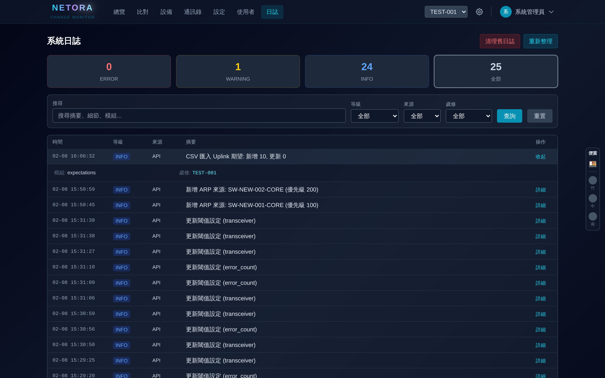
> *日誌詳情 — 展開後顯示模組、使用者、歲修 ID、IP、HTTP 請求等資訊*

點擊日誌列展開詳情，可看到：
- 模組名稱
- 操作使用者
- 歲修 ID
- IP 位址
- 請求方法與路徑
- HTTP 狀態碼

### 10.4 清理舊日誌

1. 點擊「🗑 清理舊日誌」
2. 設定保留天數（0-365 天）
3. 確認後刪除超過保留期的日誌

---

## 11. 餐點狀態（側邊欄）

> 
> *右側固定便當狀態欄（紅框標示）— 灰/紅/綠三種燈號*

畫面右側常駐便當追蹤面板：

| 燈號 | 狀態 | 說明 |
|------|------|------|
| ⚫ 灰色 | 無便當 | 尚未訂便當 |
| 🔴 紅色 | 等待中 | 已訂、在路上 |
| 🟢 綠色 ✓ | 已送達 | 便當已到！ |

**操作**：點擊燈號切換狀態（灰 → 紅 → 綠 → 灰），每 10 秒自動同步。

> 💡 Guest 角色為唯讀，無法切換燈號狀態。

---

# Part B：開發人員指南 — 擴充 Fetcher & Parser

## 1. 系統架構

```
                      scheduler.yaml (定義採集排程)
                             │
                             ▼
┌─────────┐   FetchContext   ┌───────────┐   raw_output   ┌────────┐
│Scheduler │ ──────────────→ │  Fetcher   │ ─────────────→ │ Parser │
│(APSched) │                 │(Configured │                │(Plugin)│
└─────────┘                  │ or Mock)   │                └───┬────┘
                             └───────────┘                     │
                                                    list[ParsedData]
                                                               │
                                                               ▼
                                                        ┌───────────┐
                                                        │ Indicator  │
                                                        │ (Evaluate) │
                                                        └─────┬─────┘
                                                              │
                                                    IndicatorEvaluationResult
                                                              │
                                                              ▼
                                                     ┌──────────────┐
                                                     │  Dashboard   │
                                                     │   (API)      │
                                                     └──────────────┘
```

### 資料流總結

```
scheduler.yaml 定義 fetcher name + source + interval
.env 定義 FETCHER_ENDPOINT__{NAME} = endpoint 模板
    → data_collection._collect_for_maintenance_device(collection_type="xxx")
        → fetcher_registry.get_or_raise("xxx")
            → ConfiguredFetcher.fetch(ctx) → FetchResult(raw_output="...")
                → parser_registry.get(device_type, "xxx")
                    → YourParser.parse(raw_output) → list[ParsedData]
                        → Indicator.evaluate(parsed_data) → pass/fail
```

---

## 2. 目錄結構

```
app/
├── fetchers/
│   ├── __init__.py          # 公開 API
│   ├── base.py              # BaseFetcher, FetchContext, FetchResult
│   ├── registry.py          # FetcherRegistry + setup_fetchers()
│   ├── configured.py        # ConfiguredFetcher (通用 HTTP GET)
│   ├── convergence.py       # Mock 收斂時間追蹤
│   └── mock.py              # MockFetcher 實作 (開發/測試用)
│
├── parsers/
│   ├── __init__.py
│   ├── protocols.py         # BaseParser, ParsedData 模型定義
│   ├── registry.py          # ParserRegistry + auto_discover
│   ├── client_parsers.py    # 客戶端資料 parser
│   └── plugins/             # ★ Parser 實作目錄（你寫的程式碼放這裡）
│       ├── __init__.py      # import 觸發自動註冊
│       ├── hpe_transceiver.py
│       ├── hpe_fan.py
│       ├── cisco_ios_transceiver.py
│       ├── cisco_nxos_fan.py
│       ├── ping.py          # 通用 Parser (device_type=None)
│       └── ...
│
├── indicators/              # 指標評估引擎
│   ├── base.py              # BaseIndicator
│   ├── transceiver.py       # 光模組閾值判定
│   ├── fan.py               # 風扇狀態判定
│   └── ...
│
├── services/
│   ├── data_collection.py   # 資料採集流程編排
│   ├── indicator_service.py # Dashboard 指標彙整
│   ├── scheduler.py         # APScheduler 排程器
│   └── ...
│
└── core/
    ├── config.py            # 環境變數讀取 (pydantic-settings)
    └── enums.py             # DeviceType, OperationalStatus 等列舉
```

---

## 3. 新增 Parser（保姆級步驟）

### Step 1：確認你的目標

你需要回答三個問題：
1. **哪種設備？** → `DeviceType.HPE` / `CISCO_IOS` / `CISCO_NXOS`
2. **哪種指標？** → `"transceiver"` / `"fan"` / `"power"` / `"version"` / ...
3. **API 回傳什麼格式？** → 先 curl 看 raw output

### Step 2：建立檔案

```bash
# 命名規則：{vendor}_{indicator}.py
touch app/parsers/plugins/hpe_version.py
```

### Step 3：撰寫 Parser

```python
# app/parsers/plugins/hpe_version.py

from app.core.enums import DeviceType
from app.parsers.protocols import BaseParser, VersionData
from app.parsers.registry import parser_registry


class HpeVersionParser(BaseParser[VersionData]):
    """HPE 設備韌體版本解析器。"""

    # ── class attributes ──
    device_type = DeviceType.HPE         # 可選：設 None 則為通用 Parser（如 PingParser）
    indicator_type = "version"           # ★ 必填，必須與 scheduler.yaml 一致
    command = "display version"

    def parse(self, raw_output: str) -> list[VersionData]:
        """
        解析 HPE 版本資訊。

        Tips:
        - raw_output 是 API 回傳的原始文字
        - 用 split('\n') 逐行解析
        - 用 re.search() 匹配欄位
        - 無法解析的行 → continue（不要 raise）
        - 回傳 [] 表示無資料（不是 error）
        """
        results = []

        # 範例解析邏輯：
        import re
        version_match = re.search(r'Version\s+:\s+(.+)', raw_output)
        model_match = re.search(r'Model\s+:\s+(.+)', raw_output)

        if version_match:
            results.append(VersionData(
                version=version_match.group(1).strip(),
                model=model_match.group(1).strip() if model_match else None,
            ))

        return results


# ── 檔案底部：註冊到 registry ──
parser_registry.register(HpeVersionParser())
```

### Step 4：在 `__init__.py` 加入 import

```python
# app/parsers/plugins/__init__.py

from . import hpe_version   # ← 新增這行
# ... 其他已有的 import
```

### Step 5：驗證

```bash
# 進入容器或本地環境
python -c "
from app.parsers.registry import parser_registry
from app.core.enums import DeviceType
p = parser_registry.get(DeviceType.HPE, 'version')
print(f'Found: {p.__class__.__name__}')
print(p.parse('Version : KB.16.11.0006\nModel : 5412R'))
"
```

---

## 4. 新增全新指標類型

如果你要新增一個目前不存在的指標（如 `acl`）：

### 4.1 定義 ParsedData 模型

在 `app/parsers/protocols.py` 中新增：

```python
class AclData(ParsedData):
    """ACL 規則資料。"""
    interface_name: str
    acl_number: str | None = None
```

### 4.2 新增 scheduler.yaml entry

```yaml
# config/scheduler.yaml
fetchers:
  acl:
    source: FNA
    interval: 120
    description: "ACL 規則查詢"
```

### 4.3 新增 .env endpoint

```bash
FETCHER_ENDPOINT__ACL=/api/v1/acl/{switch_ip}
```

### 4.4 撰寫 Parser

```python
# app/parsers/plugins/hpe_acl.py
class HpeAclParser(BaseParser[AclData]):
    device_type = DeviceType.HPE
    indicator_type = "acl"
    command = "display acl"
    # ...
```

### 4.5 撰寫 Indicator（若需判定通過/失敗）

在 `app/indicators/` 中新增評估器：

```python
# app/indicators/acl.py
class AclIndicator(BaseIndicator):
    name = "acl"
    title = "ACL"
    # ...
```

---

## 5. 新增外部 API Source

如果你的外部 API 不在現有 FNA / DNA / GNMSPING 之中：

### Step 1：在 `.env` 新增 Source 設定

```bash
FETCHER_SOURCE__NEWAPI__BASE_URL=http://new-api-server:9000
FETCHER_SOURCE__NEWAPI__TIMEOUT=30
```

### Step 2：在 `app/core/config.py` 註冊

找到 `FetcherSourceConfig` class，新增欄位：

```python
class FetcherSourceConfig(BaseModel):
    fna: SourceEntry | None = None
    dna: SourceEntry | None = None
    gnmsping: SourceEntry | None = None
    newapi: SourceEntry | None = None    # ← 新增
```

### Step 3：在 `scheduler.yaml` 使用

```yaml
fetchers:
  my_new_indicator:
    source: NEWAPI        # ← 使用新 source
    interval: 300
```

---

## 6. 通用 Parser（device_type=None）

某些指標的解析邏輯與設備廠牌無關（如 Ping），可建立通用 Parser：

```python
class PingParser(BaseParser[PingData]):
    device_type = None           # ← None = 適用所有設備
    indicator_type = "ping"
    command = "ping"

    def parse(self, raw_output: str) -> list[PingData]:
        # ...
```

Registry 查詢邏輯：
1. 先精確匹配 `(device_type, indicator_type)`
2. 找不到 → fallback 到 `(None, indicator_type)`

所以你可以為特定設備覆寫通用 Parser，而其他設備自動使用 fallback。

---

## 7. Mock 開發模式

開發時使用 `USE_MOCK_API=true`，系統會使用 `MockFetcher` 產生假資料。

MockFetcher 特色：
- 根據 `device_type` 產生對應廠牌格式的假資料
- 支援收斂模擬（新設備逐漸上線、舊設備逐漸離線）
- 不需外部 API，完全獨立運行

---

## 8. 除錯技巧

### 8.1 Parser 不載入

確認以下三項：
1. `__init__.py` 有 `from . import your_module`
2. 檔案底部有 `parser_registry.register(YourParser())`
3. 沒有 import error（進容器用 `python -c "from app.parsers.plugins import *"` 測試）

### 8.2 指標顯示「無採集數據」

可能原因：
- Parser 的 `indicator_type` 與 `scheduler.yaml` 的 fetcher name 不一致
- Parser `parse()` 回傳空列表（API 格式不匹配）
- 設備的 `device_type` 沒有對應的 Parser

### 8.3 紫色狀態（採集異常）

- Fetcher 回傳 `FetchResult(success=False)`
- 通常是外部 API 連線失敗、timeout 或回傳非 200
- 檢查 `.env` 中的 `FETCHER_SOURCE__xxx__BASE_URL` 和網路連通性

### 8.4 查看即時 Logs

```bash
docker-compose logs -f app 2>&1 | grep -E "(ERROR|WARNING|fetcher|parser)"
```

---

## 9. 快速參考

### ParsedData 模型對照表

| 指標 | ParsedData 類別 | 必填欄位 | 可選欄位（可為空/有預設值） |
|------|----------------|---------|--------------------------|
| transceiver | `TransceiverData` | interface_name | tx_power, rx_power, temperature, voltage |
| fan | `FanStatusData` | fan_id, status | speed_rpm, speed_percent |
| power | `PowerData` | ps_id, status | input_status, output_status, capacity_watts, actual_output_watts |
| version | `VersionData` | version | model, serial_number, uptime |
| uplink | `NeighborData` | local_interface, remote_hostname, remote_interface | remote_platform |
| port_channel | `PortChannelData` | interface_name, status, members | protocol, member_status |
| error_count | `InterfaceErrorData` | interface_name | crc_errors(=0), input_errors(=0), output_errors(=0), collisions(=0), giants(=0), runts(=0) |
| ping | `PingData` | target, is_reachable, success_rate | avg_rtt_ms |

> **必填** = Parser 必須給值，否則 Pydantic 驗證報錯。**可選** = 帶 `| None` 或有預設值，不傳不會報錯。

### 三處命名一致性檢查表

```
scheduler.yaml    .env ENDPOINT          Parser indicator_type
──────────────    ─────────────          ──────────────────────
transceiver       TRANSCEIVER            "transceiver"
fan               FAN                    "fan"
power             POWER                  "power"
version           VERSION                "version"
uplink            UPLINK                 "uplink"
port_channel      PORT_CHANNEL           "port_channel"
error_count       ERROR_COUNT            "error_count"
ping              PING                   "ping"
```
